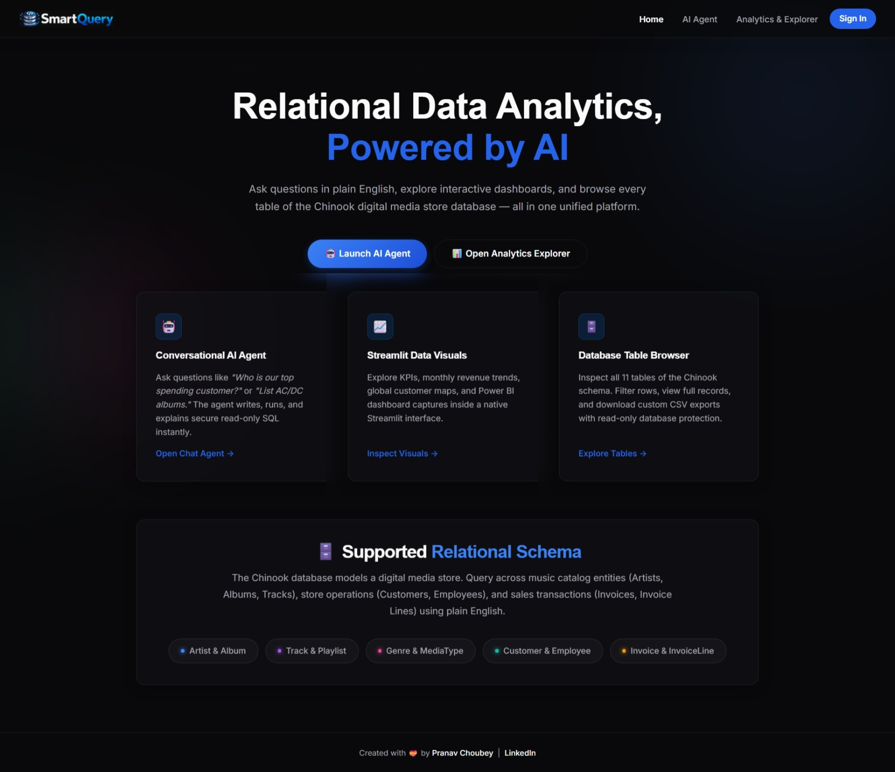
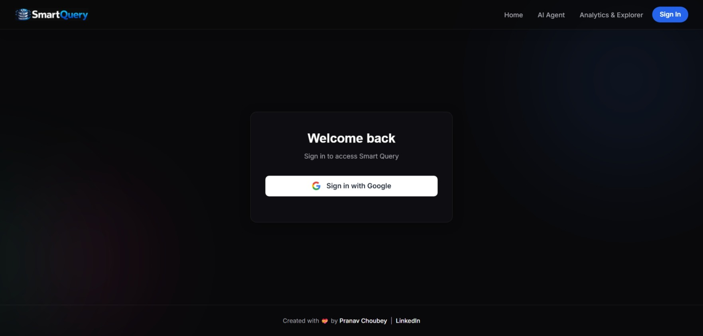
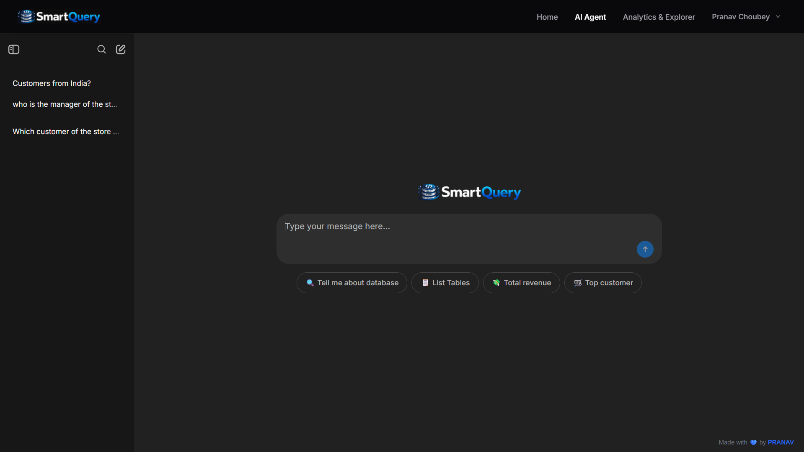
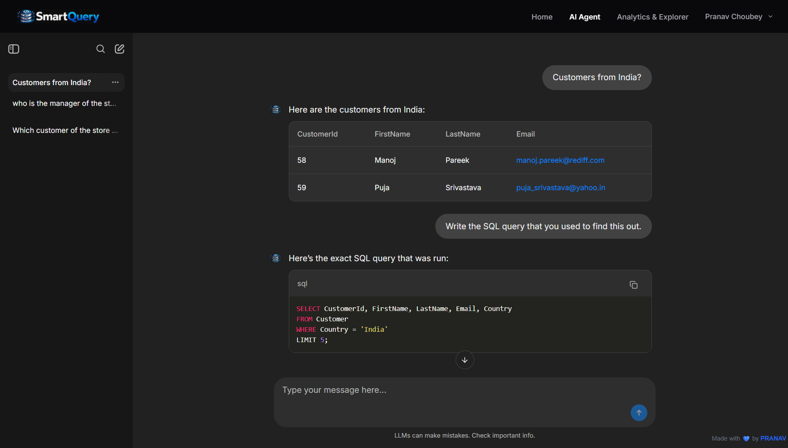
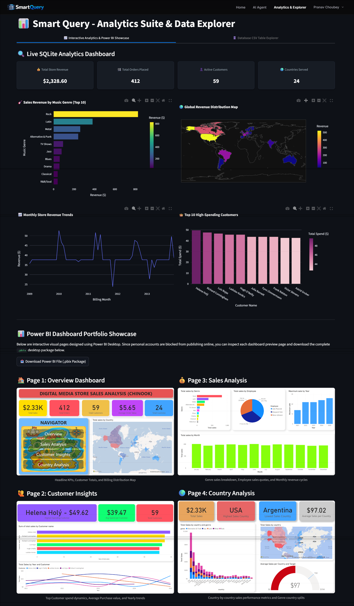
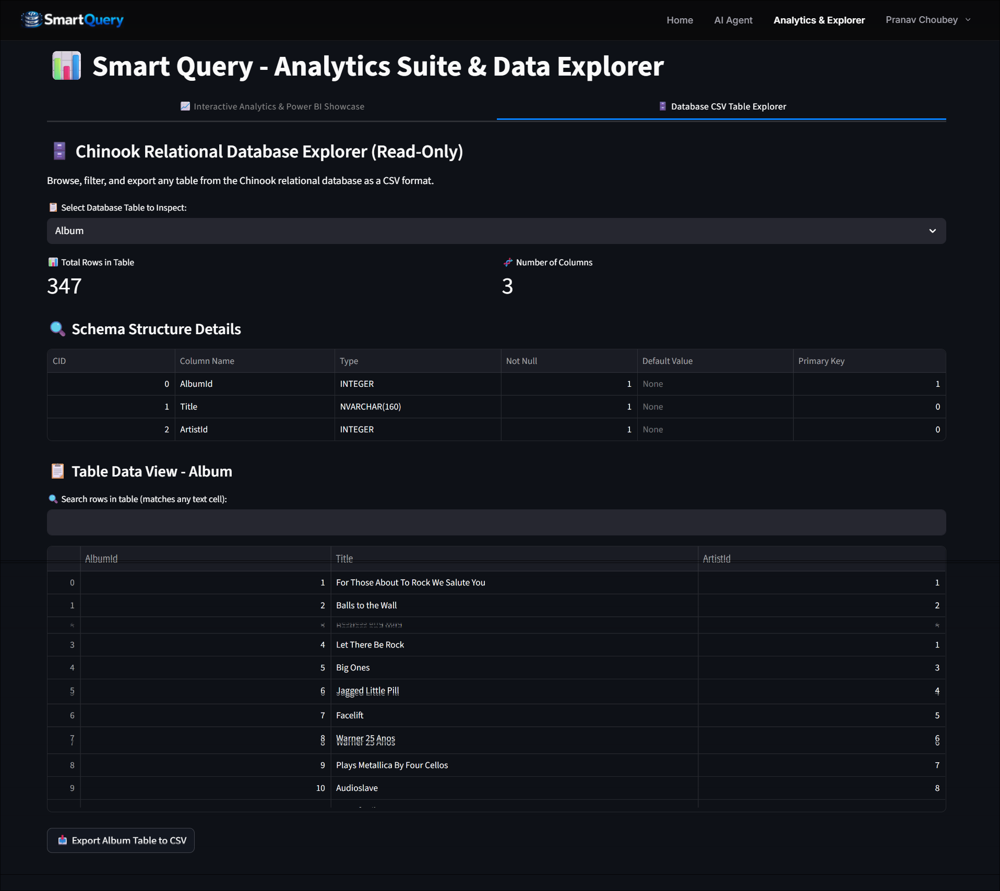
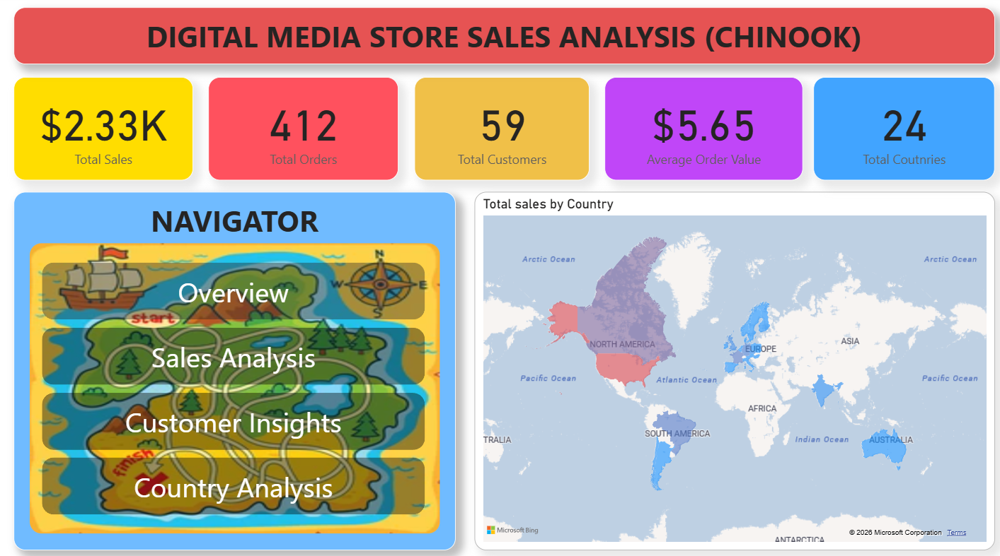

<div align="center">

# 🔍 Smart Query

### AI-Powered Data Analytics, Natural-Language SQL & Interactive BI — in One Platform

<p>
  <a href="https://smartquery-22ix.onrender.com/"><strong>🌐 Live Website</strong></a>
  &nbsp;•&nbsp;
  <a href="https://github.com/PRANAV4248/SmartQuery"><strong>💻 GitHub</strong></a>
</p>

</div>

---

## 🚀 What is Smart Query?

**Smart Query** is an end-to-end analytics platform that lets users work with a relational database through **natural language, interactive analytics, database exploration, and Power BI**—without having to switch between separate tools.

Built around the **Chinook digital media store database**, the project connects an AI-powered SQL agent to the same underlying data used by the analytics dashboard, database explorer, notebooks, and Power BI report.

Instead of starting with:

```sql
SELECT ...
FROM ...
JOIN ...
WHERE ...
```

you can simply ask:

> **"Who is the top customer by total spending?"**

Smart Query handles the database interaction behind the scenes and returns the result as a conversational answer.

### The current platform brings together

| Experience | What it does |
|---|---|
| 🤖 **AI Agent** | Ask questions about the database in natural language |
| 📊 **Analytics Suite** | Explore live KPIs, trends, genre performance, geography, and customers |
| 🗄️ **Database Explorer** | Inspect tables, schemas, records, search results, and CSV exports |
| 📈 **Power BI Showcase** | Explore the four-page BI report and download the `.pbix` file |
| 🐍 **EDA Notebooks** | Explore the underlying data with Python and statistical analysis |
| 🔐 **Authentication** | Google OAuth with shared authentication across the application |

---

## 🌐 Try the Live Application

<div align="center">

### 👉 [Open Smart Query](https://smartquery-22ix.onrender.com/)

</div>

---

# 🖥️ The Current Smart Query Experience

The application has been redesigned into a unified web experience rather than a standalone SQL chatbot.

### 🏠 Aesthetic Home Page



### 🔐 Secure Google Based Authentication System



### 🤖 AI Agent With Chat Storage



### 💬 Conversational SQL Agent With Memory



### 📊 Data Analytics Suite



### 🗄️ Database Explorer And Downloader



---

# 🧠 How Smart Query Works

At its core, Smart Query turns a natural-language question into a database-backed answer.

```text
┌──────────────────────┐
│      User Question   │
│ "Who spent the most?"│
└──────────┬───────────┘
           │
           ▼
┌──────────────────────┐
│   AI Agent           │
│ LangChain + LangGraph│
└──────────┬───────────┘
           │
           ▼
┌──────────────────────┐
│ SQL Generation       │
│ Read-only analysis   │
└──────────┬───────────┘
           │
           ▼
┌──────────────────────┐
│ Chinook SQLite DB    │
│ 11 relational tables │
└──────────┬───────────┘
           │
           ▼
┌──────────────────────┐
│ Query Result         │
└──────────┬───────────┘
           │
           ▼
┌──────────────────────┐
│ Natural-Language     │
│ Answer               │
└──────────────────────┘
```

The same database can then be explored visually through the Analytics Suite, inspected directly through the Database Explorer, analyzed through Python notebooks, or presented through Power BI.

---

# 🤖 AI Agent

## Ask the database instead of writing SQL

The Smart Query Agent provides a conversational interface over the Chinook database.

The user does not need to know:

- table names
- foreign keys
- JOIN syntax
- aggregation logic
- filtering syntax
- SQL query structure

The agent handles the database interaction and presents the result conversationally.

### Example questions

**🎵 Music**

```text
Show me the top 5 selling tracks of all time.
```

```text
List all albums by AC/DC.
```

```text
Which genre has the most tracks?
```

**👥 Customers**

```text
Who is the top customer by total spending?
```

```text
Which countries have the most invoices?
```

```text
How many customers are from Brazil?
```

**🗄️ Database**

```text
Tell me about the database.
```

```text
List all tables.
```

```text
Show me the playlists.
```

### 💬 Conversational follow-ups

Smart Query is designed for multi-turn analysis.

For example:

```text
User: Who is the top artist?

AI: ...

User: What are their top 3 songs?

AI: ...
```

The second question can be asked in the context of the first rather than starting a completely new interaction.

---

## 🛡️ Read-Only Database Workflow

The AI workflow is designed around analytical, read-only access to the Chinook database.

The agent is instructed to:

- use database queries only when required
- retrieve data through SQL
- avoid destructive database operations
- handle SQL execution errors
- keep internal tool execution separate from the final response
- return useful natural-language answers

The goal is simple:

> **Ask questions. Get insights. Leave the source database untouched.**

---

# 📊 Data Analytics Suite

Smart Query's redesigned Data Analytics Suite provides live analysis directly from the Chinook SQLite database.

The application uses **Streamlit + Pandas + Plotly** for the interactive analytical layer.

## 📌 Live KPIs

The dashboard calculates:

- 💰 Total Store Revenue
- 🛒 Total Orders
- 👤 Total Customers
- 🌍 Countries Served

## 📈 Interactive Visual Analysis

The current analytics view includes:

### 🎸 Revenue by Genre

Compare the top music genres by sales revenue.

### 📅 Monthly Revenue Trends

Track store revenue over time using a monthly trend chart.

### 🌍 Global Revenue Distribution

Explore country-level revenue using an interactive geographic visualization.

### 👑 Top Customers

Identify the highest-spending customers in the store.

All of these views are calculated from the underlying SQLite database rather than from a separate copied dataset.

---

# 🗄️ Database Explorer

The Database Explorer turns the Chinook SQLite file into an interactive, read-only data browser.

### You can

- select any database table
- inspect row counts
- inspect column counts
- view schema metadata
- see column types
- identify primary keys
- browse table records
- search across table values
- export the current table view as CSV

### Example workflow

```text
Select Table
     ↓
Inspect Schema
     ↓
Browse Records
     ↓
Search / Filter
     ↓
Export CSV
```

The explorer reads directly from:

```text
analysis/resources/Chinook.db
```

---

# 📈 Power BI Dashboard

Smart Query also contains a complete **four-page Power BI dashboard** built from the Chinook dataset.

The full Power BI report is available in the repository:

```text
analysis/dashboards/Chinook Dashboard.pbix
```

The Analytics Suite also provides a download button for the `.pbix` package so it can be opened locally in **Power BI Desktop**.

## Dashboard Pages

### 01 — Overview

Headline KPIs, customer totals, billing distribution, and geographic sales.



### 02 — Customer Insights

Customer spending patterns, average purchase values, and yearly trends.


### 03 — Sales Analysis

Genre performance, employee sales metrics, and revenue trends.


### 04 — Country Analysis

Country-level sales performance and genre distribution.


---

## 📌 Insights from the Chinook Analysis

The original Power BI analysis surfaced:

- 💵 **$2.33K** total sales
- 🛒 **412 orders**
- 👥 **59 customers**
- 🌍 **24 countries**
- 🇺🇸 USA as the highest-selling country
- 🇦🇷 Argentina as the lowest-selling country
- 🎸 Rock as the best-selling genre
- 👤 Helena Holý as the top customer by total spend at **$49.62**

These figures come from the original dashboard analysis and are retained here as project findings.

---

# 🐍 Python EDA

The repository also includes Jupyter notebooks for lower-level data exploration.

```text
analysis/notebooks/
├── EDA.ipynb
└── sqldb.ipynb
```

The EDA workflow uses Python data-science tooling to explore the same Chinook database.

### Analysis includes

- loading SQLite tables into Pandas
- table previews
- schema inspection
- `.info()` analysis
- `.describe()` statistics
- total revenue analysis
- customer distribution by country
- revenue by country
- revenue share visualization
- revenue by media type
- monthly revenue trends
- genre/country analysis
- heatmap-based exploration

This creates a useful analytical path from:

```text
Raw Relational Data
        ↓
Python EDA
        ↓
Business Insights
        ↓
Power BI / AI Agent / Live Analytics
```

---

# 🗃️ The Chinook Database

The project uses the **Chinook digital media store database** as its analytical source of truth.

The schema models a digital music store with relationships between customers, invoices, tracks, artists, albums, playlists, and employees.

### Core relationships

```text
Artist
   │
   └── Album
          │
          └── Track
                 ├── Genre
                 └── MediaType


Customer
   │
   └── Invoice
          │
          └── InvoiceLine
                    │
                    └── Track


Playlist
   │
   └── PlaylistTrack
              │
              └── Track


Employee
   │
   └── Customer
```

The relational database is stored at:

```text
analysis/resources/Chinook.db
```

The SQL representation is also available at:

```text
analysis/sql/database_content.sql
```

### Database relationship visual


---

# 🔐 Authentication Architecture

The redesigned application uses **Google OAuth** as its authentication entry point.

The main FastAPI application:

1. sends the user to Google authentication
2. receives the OAuth callback
3. creates or retrieves the application user
4. creates the application session
5. bridges authentication into Chainlit
6. creates a short-lived SSO token when the user opens Analytics & Explorer

### Authentication flow

```text
                 ┌───────────────┐
                 │ Google OAuth  │
                 └───────┬───────┘
                         │
                         ▼
                 ┌───────────────┐
                 │    FastAPI    │
                 │ Auth / Session│
                 └───────┬───────┘
                         │
              ┌──────────┴──────────┐
              │                     │
              ▼                     ▼
       ┌──────────────┐      ┌───────────────┐
       │   Chainlit   │      │   Streamlit   │
       │  AI Agent    │      │ Analytics /   │
       │              │      │ Explorer      │
       └──────────────┘      └───────────────┘
```

The Streamlit application validates a short-lived SSO token before allowing access.

---

# 🏗️ Application Architecture

```text
                         USER
                          │
                          ▼
              ┌─────────────────────┐
              │    FastAPI Web App  │
              │                     │
              │ Home / Login / Chat │
              │ / Explorer Wrapper  │
              └─────────┬───────────┘
                        │
          ┌─────────────┼─────────────┐
          │             │             │
          ▼             ▼             ▼
     Google OAuth   Chainlit      Streamlit
                    /agent        /explorer
                       │              │
                       ▼              ▼
                 LangChain +      Pandas +
                 LangGraph       Plotly
                       │              │
                       └──────┬───────┘
                              │
                              ▼
                     ┌────────────────┐
                     │ Chinook SQLite │
                     │    Database    │
                     └───────┬────────┘
                             │
             ┌───────────────┼────────────────┐
             ▼               ▼                ▼
        AI Answers      Live Analytics     Power BI
                                             .pbix
```

---

# 🧰 Technology Stack

| Layer | Technology |
|---|---|
| **Language** | Python |
| **Web Backend** | FastAPI |
| **ASGI Server** | Uvicorn |
| **AI Framework** | LangChain |
| **Agent Orchestration** | LangGraph |
| **LLM Provider** | Groq |
| **Conversational UI** | Chainlit |
| **Analytics Application** | Streamlit |
| **Data Manipulation** | Pandas |
| **Visualization** | Plotly |
| **Business Intelligence** | Power BI |
| **Analytical Database** | SQLite |
| **Application / Persistence DB** | PostgreSQL / SQLite checkpointing |
| **ORM** | SQLAlchemy |
| **Authentication** | Google OAuth + JWT |
| **Package Management** | UV |
| **Deployment** | Render + Streamlit deployment |

The repository currently specifies **Python >= 3.12** and includes FastAPI, Chainlit 2.9.6+, LangChain, LangGraph, Streamlit, Plotly, SQLAlchemy, PostgreSQL drivers, and related dependencies in `pyproject.toml`.

---

# 📁 Project Structure

```text
SmartQuery/
│
├── .chainlit/
│
├── analysis/
│   ├── dashboards/
│   │   ├── Chinook Dashboard.pbix
│   │   ├── Overview.png
│   │   ├── Customer insights.png
│   │   ├── Sales analysis.png
│   │   ├── Country analysis.png
│   │   └── Tables Relationships.png
│   │
│   ├── notebooks/
│   │   ├── EDA.ipynb
│   │   └── sqldb.ipynb
│   │
│   ├── resources/
│   │   └── Chinook.db
│   │
│   ├── screenshots/
│   │   ├── home_page.jpeg
│   │   ├── login_page.jpeg
│   │   ├── agent_home.png
│   │   ├── agent_chat.png
│   │   ├── analytics_page.png
│   │   └── explorer_page.png
│   │
│   └── sql/
│       └── database_content.sql
│
├── public/
│   ├── css/
│   ├── custom.css
│   ├── favicon.png
│   ├── footer.js
│   ├── logo_dark.png
│   ├── logo_light.png
│   └── logo_nav.png
│
├── src/
│   ├── app.py
│   ├── auth.py
│   ├── database.py
│   ├── explorer_app.py
│   ├── main.py
│   └── sqlagent.py
│
├── templates/
│   ├── base.html
│   ├── chat.html
│   ├── explorer.html
│   ├── home.html
│   └── login.html
│
├── .gitignore
├── .python-version
├── pyproject.toml
├── README.md
└── uv.lock
```

---

# ⚡ Run Locally

## 1. Clone

```bash
git clone https://github.com/PRANAV4248/SmartQuery.git
cd SmartQuery
```

## 2. Install dependencies

Smart Query uses **UV** for package management.

```bash
uv sync
```

The project requires **Python 3.12+**.

## 3. Configure environment variables

Create a `.env` file in the project root.

```env
CHAINLIT_AUTH_SECRET=your_secret

# Groq API
GROQ_API_KEY=your_groq_api_key

# Google OAuth
GOOGLE_CLIENT_ID=your_google_client_id
GOOGLE_CLIENT_SECRET=your_google_client_secret
GOOGLE_REDIRECT_URI=http://localhost:8000/auth/google/callback

# Application / Persistence Database
DATABASE_URL=your_database_url

# Application URLs
STREAMLIT_APP_URL=http://localhost:8501
MAIN_APP_URL=http://localhost:8000
```

Never commit real secrets or credentials.

## 4. Start the main application

```bash
uv run python -m src.main
```

The FastAPI application runs on:

```text
http://localhost:8000
```

## 5. Start Analytics & Explorer

Open a second terminal:

```bash
uv run streamlit run src/explorer_app.py
```

Streamlit normally runs on:

```text
http://localhost:8501
```

Set `STREAMLIT_APP_URL` accordingly when running locally.

---

# 🔑 Environment Variables

| Variable | Purpose |
|---|---|
| `CHAINLIT_AUTH_SECRET` | Shared signing secret for application authentication and SSO |
| `GROQ_API_KEY` | API key used to access the Groq-hosted LLM |
| `GOOGLE_CLIENT_ID` | Google OAuth client ID |
| `GOOGLE_CLIENT_SECRET` | Google OAuth client secret |
| `GOOGLE_REDIRECT_URI` | OAuth callback URL |
| `DATABASE_URL` | Application/persistence database connection |
| `STREAMLIT_APP_URL` | Analytics & Explorer application URL |
| `MAIN_APP_URL` | Main Smart Query application URL |

The exact deployment environment may provide these values through platform secrets rather than a local `.env` file.

---

# 🔒 Security & Design Notes

Smart Query separates the **analytical database** from the **application authentication/persistence layer**.

### Analytical layer

```text
Chinook.db
   ↓
Read-only analysis
```

### Application layer

```text
Authentication
     ↓
User / Session Data
     ↓
PostgreSQL / SQLite-backed persistence
```

The current authentication implementation uses Google OAuth, signed application session cookies, Chainlit authentication bridging, and short-lived Streamlit SSO tokens.

The Streamlit application validates the SSO token before exposing Analytics & Explorer.

---

# 📦 Power BI Asset

The complete desktop report is included in the repository:

```text
analysis/dashboards/Chinook Dashboard.pbix
```

If you want to inspect or modify the full Power BI report, download the `.pbix` package and open it in **Power BI Desktop**.

---

# 🎯 Why This Project Matters

Smart Query demonstrates how several data and AI workflows can be combined into one production-oriented application:

```text
                 ┌─────────────────┐
                 │ Natural Language│
                 └────────┬────────┘
                          ▼
                 ┌─────────────────┐
                 │   AI / Agents   │
                 └────────┬────────┘
                          ▼
                 ┌─────────────────┐
                 │     SQL / DB    │
                 └────────┬────────┘
                          ▼
        ┌─────────────────┼─────────────────┐
        ▼                 ▼                 ▼
   AI Answers        Analytics          Power BI
        │                 │                 │
        └─────────────────┼─────────────────┘
                          ▼
                  Business Insights
```

It combines:

- **Agentic AI**
- **Full-stack Python development**
- **Authentication**
- **Business intelligence**
- **Database Management**
- **Natural-language database querying**
- **Relational SQL**
- **Data visualization**
- **Exploratory data analysis**
- **Application-to-application SSO**
- **Cloud deployment**

---

# 👨‍💻 Author

## Pranav Choubey

**AI/ML Engineer** building end-to-end AI, data science, and intelligent analytics applications.

**LinkedIn:**  
https://www.linkedin.com/in/pranavchoubey89/

**GitHub:**  
https://github.com/PRANAV4248

---

<div align="center">

### ⭐ If you found Smart Query interesting, feel free to share your feedback.


**Built with 💝 by Pranav Choubey**

</div>
